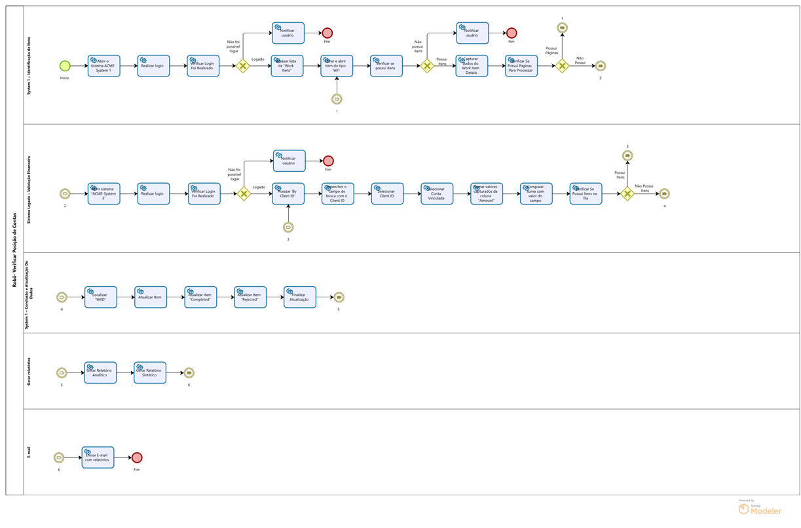

# 🔍 Processo: Verificar Posição de Contas

Este processo tem como objetivo verificar e validar a consistência dos valores financeiros entre os sistemas ACME System 1 e ACME System 3, garantindo integridade nas informações de contas a pagar.  
A automação foi desenvolvida com foco em rastreabilidade, redução de falhas manuais e comunicação eficiente.

---
##  Visão Geral do Processo

## Fluxo Ideal

1. Acessar o sistema **ACME System 1**
2. Efetuar login com as credenciais da planilha “Acesso”
3. Filtrar itens do tipo:
   - "Type = WI1"
   - "Status = Open"
   - "Description = Verify Account Position"
4. Capturar os dados: "Client ID" e "WIID"
5. Acessar o sistema legado **ACME System 3**
6. Realizar login com as credenciais da planilha “Acesso Legado”
7. Buscar cliente por "Client ID"
8. Selecionar a conta vinculada e acessar a aba com os valores
9. Somar todos os valores da coluna **Amount**
10. Comparar com o campo **Account Amount**
11. Atualizar o status no ACME System 1:
    - "Completed" se os valores forem iguais
    - "Rejected" se forem diferentes
12. Registrar comentário conforme resultado
13. Salvar o resultado no banco de dados
14. Gerar relatórios analítico e sintético
15. Enviar e-mail com os relatórios

---

##  Melhorias implementadas no processo

- **Inclusão de banco de dados (TBL_Verificacao_Contas_Cliente):**  
  Permitiu armazenar informações capturadas de forma estruturada e segura, eliminando o uso de arquivos temporários e tornando o processo mais rastreável e dinâmico.

- **Criação de logs para exceções:**  
  Toda exceção durante o processo (ex: falha no login, dados inconsistentes, sistemas indisponíveis) é registrada na base e no relatório sintético, permitindo análise posterior e facilitando a manutenção.

- **Automação do preenchimento de relatórios:**  
  Os relatórios analítico e sintético são preenchidos automaticamente com base na execução real, otimizando tempo e garantindo padronização.

- **Gatilho de envio automático de e-mail ao final do processo:**  
  Garante que os responsáveis recebam os resultados sem a necessidade de intervenção manual, fechando o ciclo da automação com comunicação.

---

##  Tratativas em caso de exceções

### 1. Exceção no login no ACME System 1 ou ACME System 3
- Validar se os dados da planilha “Acesso” estão corretos
- Verificar conexão com a internet e disponibilidade dos sistemas
- Se a exceção persistir, registrar na base e reencaminhar para reprocesso

### 2. Não encontrar itens com os filtros (WI1, Open, Description)
- Registrar ocorrência com mensagem: “Nenhum item WI1 disponível com status Open”
- Encerrar o processo e notificar via e-mail de status

### 3. Exceção ao capturar Client ID ou WIID
- Registrar a exceção com o identificador da tentativa
- Marcar como exceção no relatório sintético
- Seguir para o próximo item da fila

### 4. Sistema legado inacessível ou instável
- Verificar se o ACME System 3 está aberto corretamente
- Tentar reabrir o atalho ou reiniciar a sessão
- Após 3 tentativas, registrar a exceção, pular item, seguir com os demais

### 5. Conta vinculada não localizada
- Adicionar no comentário: “Conta vinculada não encontrada”
- Atualizar status como "Rejected" e seguir fluxo

### 6. Soma da coluna Amount não bate com Account Amount
- Atualizar status como "Rejected"
- Comentário: “Valores divergentes entre sistema 1 e 2”
- Registrar na base e no relatório

### 7. Exceção ao atualizar status no ACME System 1
- Verificar se o WIID está correto
- Se persistir, registrar exceção e seguir com próximos

### 8. Falha na geração de relatórios
- Registrar como exceção
- Enviar e-mail com aviso e relatar qual etapa não foi concluída

---

##  Observações

- Todas as exceções são registradas na base de dados com status "Exceção"
- Cada ocorrência também é marcada no relatório sintético como “Exceção”
- A execução continua com os próximos itens da fila sempre que possível
